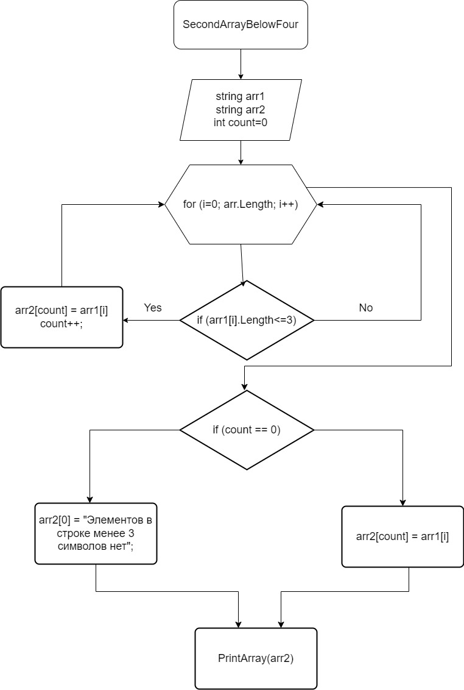

## Итоговая проверочная работа

## Задача
 Написать программу, которая из имеющегося массива строк формирует массив из строк, длина которых меньше или равна 3. Первоначальный массив можно ввести с клавиатуры, либо задать на старте выполнения алгоритма. При решение не рекомендуется пользоваться коллекциями, лучше обойтись исключительно массивами.

## Описание алгоритма решения:
Появляется прглашение ко вводу строки "Введите элементы строки (через пробел): ". 

Метод SecondArrayBelowFour, в котором есть цикл по длине исходного (введенного) массива, внутри цикла есть проверка условия ( меньше/равно 3 ), если да элемент первого массива заносится в count элемент второго массива. Переменная count это счетчик элементов нового переработанного массива по условиям задачи. После присвоения значения второму массиву (добавляется новый элемент) увеличивается переменная count на 1 и возвращается к циклу for в котором i увеличивается на 1. Есть проверка на пустой новый (переработанный) массив. Если он не заполнен в результате проверки всех элементов массива, т.е. count = 0, то первому(нулевому) элементу массива присваивается значение "Элементов в строке менее 3 символов нет".
### Графическое представление метода в отдельной папке в репозитории в двух файлах разных расширениях.
### Реализация алгоритма по пути finish_task/Program.cs
## Графическое представление метода.
